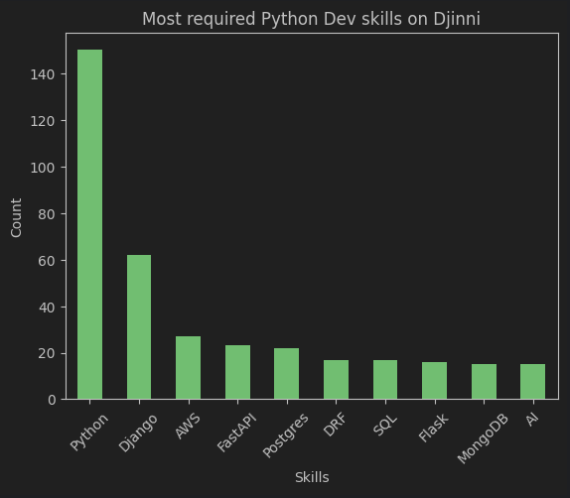

# Djinni Job Analysis
- Project helps to scrape Djinni jobs page and find most popular skills for your position.
- The project is made for Python Jobs scraping, but you can change it for your own needs.

## Disclaimer!
- Sadly we cannot scrape all pages without login anymore.
- No accounts were banned during testing, but...
- It's better to use the VPN to scrape it, don't risk your own IP.
- It's better to use fake account on Djinni.

## Local installation:
1. **Clone the repository:**

   ```sh
   git clone https://github.com/panicua/Job-Analysis.git
   cd Job-Analysis
   ```

2. Create an `.env` file in the root of the project directory. You can use the `.env.sample` file as a template:
   ```sh
   cp .env.example .env
   ```
   don't forget to fill it with your credentials

3. Create and activate **venv** (bash):

   ```sh
   python -m venv venv
   source venv/Scripts/activate
   ```

   Windows (Command Prompt)

   ```sh
   python -m venv venv
   venv\Scripts\activate
   ```

   Mac / Linux (Unix like systems)

   ```sh
   python3 -m venv venv
   source venv/bin/activate
   ```

4. Install **requirements.txt** to your **venv**:

   ```sh
   pip install -r requirements.txt
   ```

## DEMO:
Dependency of skills/technologies to number of those technologies (205 vacancies):


Dependency of salary offers to number of those offers (only 29 offers displayed their offer, so statistic is not very reliable)
